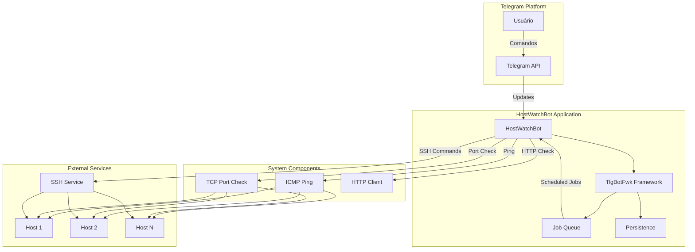
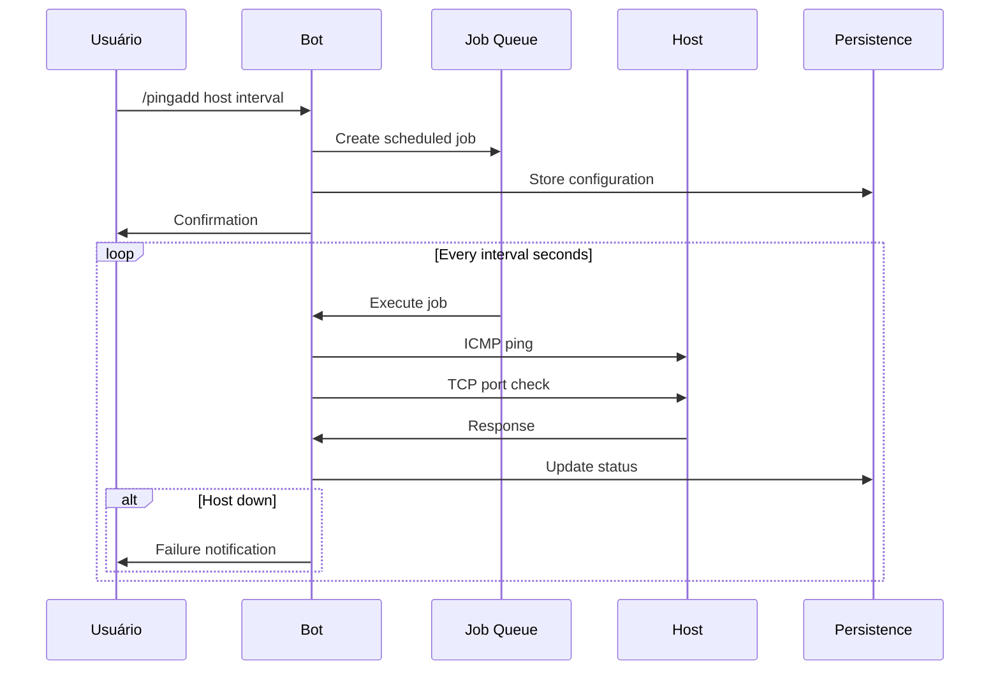
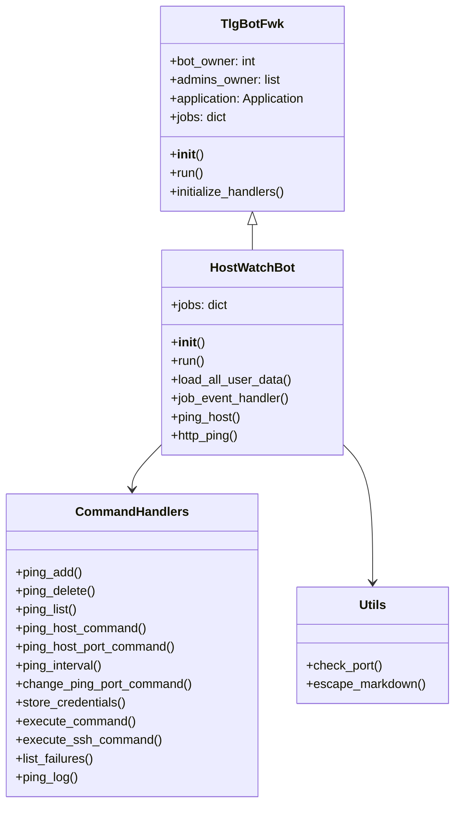
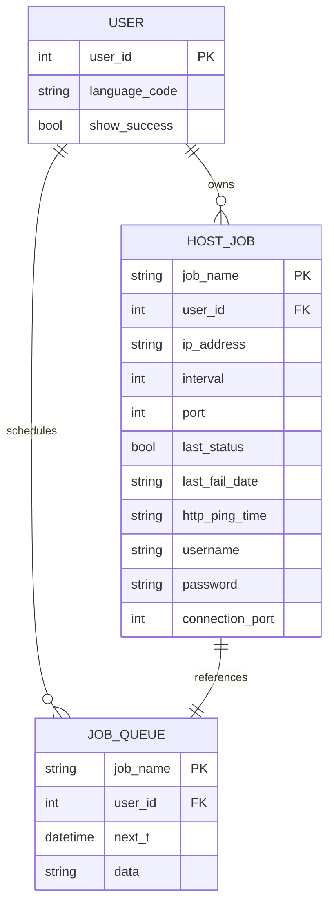
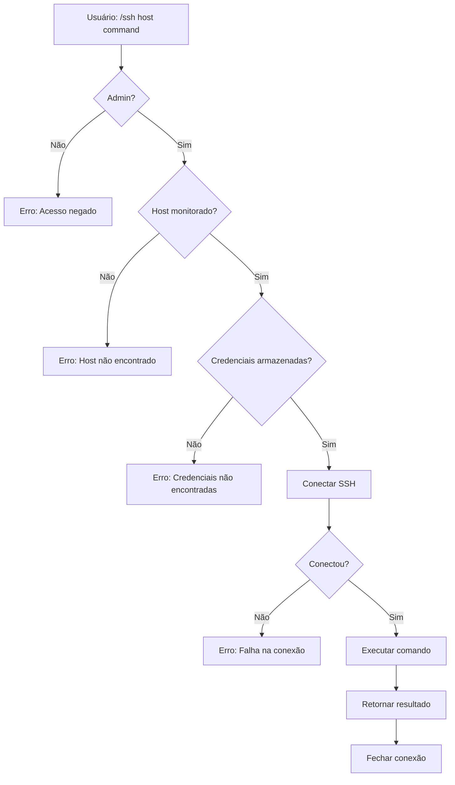
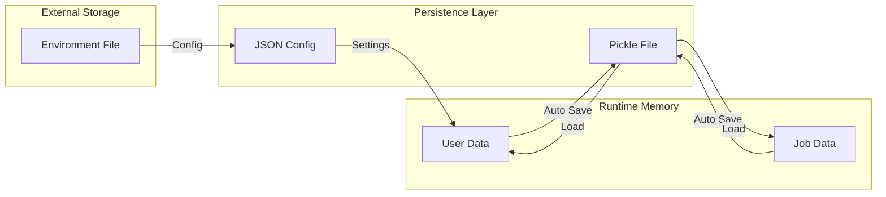
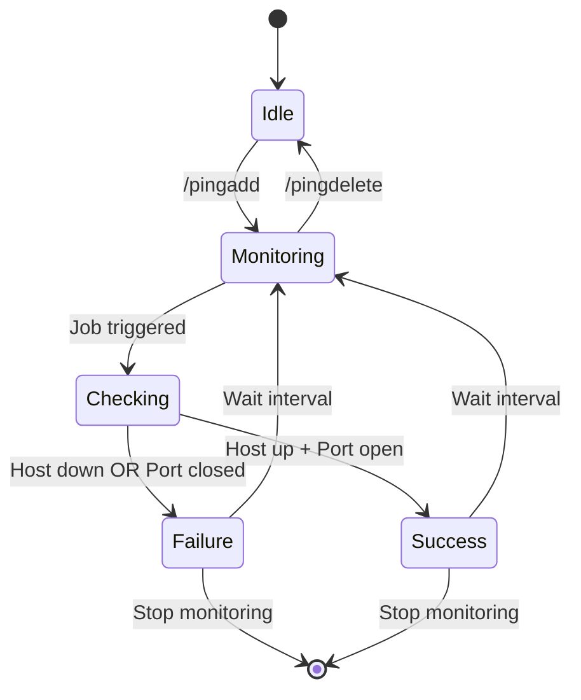
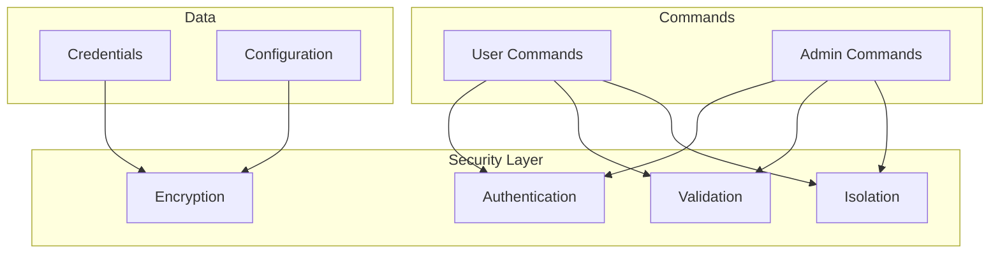
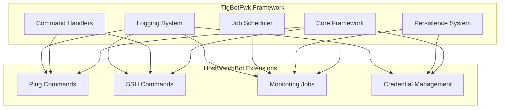
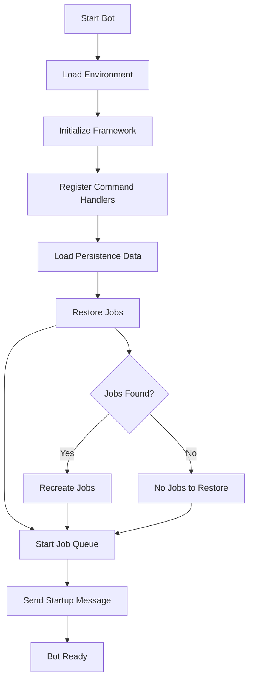

# Diagrama de Arquitetura - HostWatchBot

## 1. Arquitetura Geral

## 2. Fluxo de Monitoramento

## 3. Estrutura de Classes

## 4. Estrutura de Dados

## 5. Fluxo de Comandos SSH

## 6. Sistema de Persistência

## 7. Monitoramento de Estado

## 8. Componentes de Segurança

## 9. Integração com Framework Base

## 10. Fluxo de Inicialização

