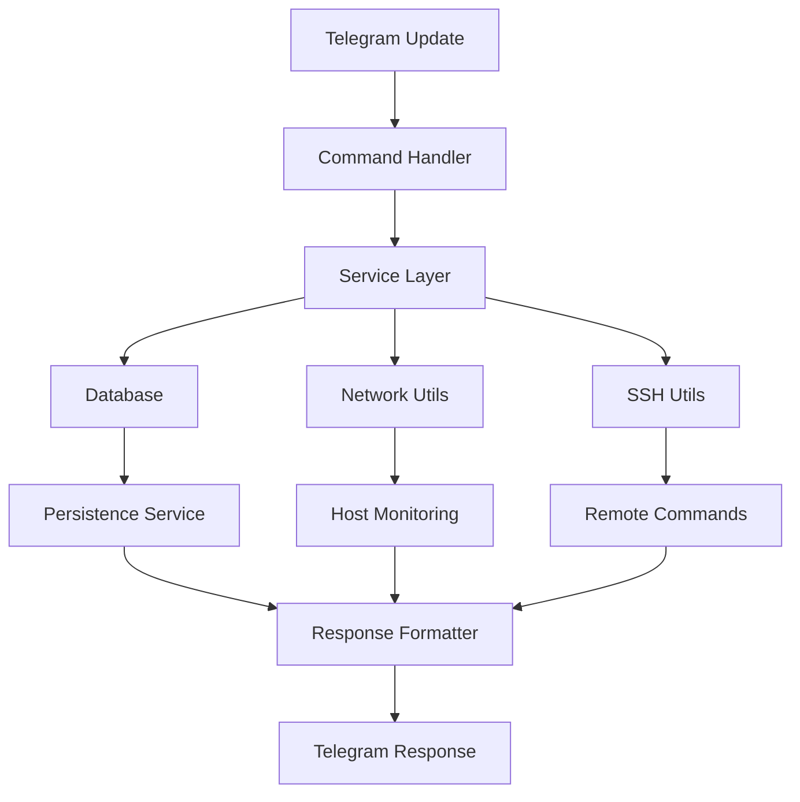

# Architecture Documentation

## Overview

The Modern Host Watch Bot is built with a clean, modular architecture that follows modern Python best practices. The design emphasizes separation of concerns, type safety, and maintainability.

## Architecture Layers

### 1. Configuration Layer (`src/config/`)
- **Purpose**: Centralized configuration management
- **Components**:
  - `settings.py`: Pydantic-based settings with environment variable support
- **Benefits**: Type-safe configuration, validation, and easy testing

### 2. Data Models Layer (`src/models/`)
- **Purpose**: Data structures and validation
- **Components**:
  - `host.py`: Host monitoring models (HostConfig, HostStatus, HostJob)
  - `user.py`: User management models (User, UserPreferences)
- **Benefits**: Pydantic validation, serialization, and type safety

### 3. Utilities Layer (`src/utils/`)
- **Purpose**: Reusable utility functions
- **Components**:
  - `network.py`: Network connectivity checks (ping, port scanning)
  - `ssh.py`: SSH connection and command execution
  - `formatters.py`: Message formatting for Telegram
- **Benefits**: Modular, testable, and reusable components

### 4. Services Layer (`src/services/`)
- **Purpose**: Business logic and data persistence
- **Components**:
  - `persistence.py`: Database operations and data storage
  - `monitoring.py`: Host monitoring service and job management
- **Benefits**: Separation of business logic from handlers

### 5. Handlers Layer (`src/handlers/`)
- **Purpose**: Telegram command processing
- **Components**:
  - `command_handlers.py`: User command handlers
  - `admin_handlers.py`: Admin-only command handlers
- **Benefits**: Clean separation of user and admin functionality

### 6. Core Layer (`src/core/`)
- **Purpose**: Main application orchestration
- **Components**:
  - `bot.py`: Main bot application class
- **Benefits**: Centralized application management

## Data Flow



## Key Design Principles

### 1. Dependency Injection
- Services are injected into handlers
- Easy to test and mock dependencies
- Loose coupling between components

### 2. Async/Await Throughout
- Non-blocking operations for better performance
- Proper handling of I/O operations
- Scalable architecture

### 3. Type Safety
- Full type annotations with mypy support
- Pydantic models for data validation
- Catch errors at development time

### 4. Error Handling
- Comprehensive try-catch blocks
- Graceful error recovery
- User-friendly error messages

### 5. Configuration Management
- Environment-based configuration
- Type-safe settings with validation
- Easy deployment across environments

## Database Design

### Users Table
```sql
CREATE TABLE users (
    user_id INTEGER PRIMARY KEY,
    username TEXT,
    first_name TEXT,
    last_name TEXT,
    is_admin BOOLEAN DEFAULT FALSE,
    is_owner BOOLEAN DEFAULT FALSE,
    preferences TEXT,  -- JSON
    created_at TEXT,
    last_activity TEXT,
    is_active BOOLEAN DEFAULT TRUE
);
```

### Host Jobs Table
```sql
CREATE TABLE host_jobs (
    job_id TEXT PRIMARY KEY,
    user_id INTEGER,
    host_config TEXT,  -- JSON
    host_status TEXT,  -- JSON
    created_at TEXT,
    updated_at TEXT,
    is_active BOOLEAN DEFAULT TRUE,
    FOREIGN KEY (user_id) REFERENCES users (user_id)
);
```

## Security Architecture

### 1. Credential Encryption
- SSH passwords encrypted with Fernet (AES-128)
- Encryption key stored in environment variables
- No plaintext credentials in database

### 2. Access Control
- Role-based permissions (user, admin, owner)
- Admin-only commands for sensitive operations
- User isolation for host management

### 3. Input Validation
- Pydantic models validate all inputs
- SQL injection protection with parameterized queries
- Type checking prevents many security issues

### 4. Error Handling
- No sensitive information in error messages
- Proper logging without exposing internals
- Graceful degradation on failures

## Monitoring Architecture

### 1. Job Scheduling
- Uses python-telegram-bot's JobQueue
- Persistent job storage in database
- Automatic job restoration on startup

### 2. Health Checks
- Concurrent ping and port checks
- Configurable timeouts and intervals
- Comprehensive status tracking

### 3. Notifications
- Real-time failure notifications
- Configurable notification preferences
- Cooldown periods to prevent spam

## Testing Strategy

### 1. Unit Tests
- Individual component testing
- Mock external dependencies
- High test coverage

### 2. Integration Tests
- End-to-end workflow testing
- Database integration testing
- Network operation testing

### 3. Configuration
- pytest for test framework
- Coverage reporting
- Type checking with mypy

## Deployment Architecture

### 1. Environment Configuration
- `.env` file for local development
- Environment variables for production
- Secure credential management

### 2. Logging
- Structured logging with timestamps
- Configurable log levels
- File and console output

### 3. Error Monitoring
- Comprehensive error logging
- Graceful error recovery
- User-friendly error messages

## Scalability Considerations

### 1. Database
- SQLite for simplicity (can be replaced with PostgreSQL)
- Efficient queries with proper indexing
- Connection pooling for high concurrency

### 2. Memory Management
- Proper cleanup of resources
- Efficient data structures
- Minimal memory footprint

### 3. Performance
- Async operations for I/O
- Concurrent host monitoring
- Optimized database queries

## Future Enhancements

### 1. Microservices
- Split into separate services
- API-based communication
- Independent scaling

### 2. Message Queues
- Redis/RabbitMQ for job queuing
- Better handling of high load
- Distributed processing

### 3. Monitoring Integration
- Prometheus metrics
- Grafana dashboards
- Alert manager integration

### 4. Multi-tenancy
- Support for multiple bot instances
- Shared infrastructure
- Resource isolation

## Best Practices Implemented

1. **Clean Code**: Clear naming, small functions, single responsibility
2. **SOLID Principles**: Dependency inversion, open/closed principle
3. **DRY**: No code duplication, reusable components
4. **KISS**: Simple, straightforward implementations
5. **Documentation**: Comprehensive docstrings and comments
6. **Error Handling**: Robust error handling throughout
7. **Logging**: Structured logging for debugging
8. **Testing**: Comprehensive test coverage
9. **Type Safety**: Full type annotations
10. **Security**: Secure by design principles 